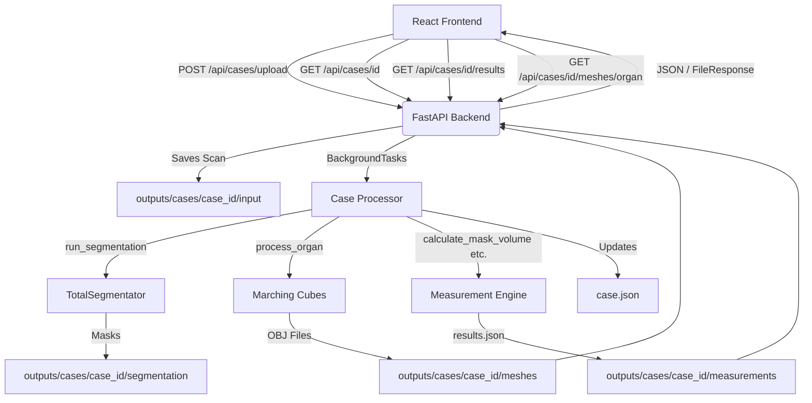

# API Architecture Reference

This document outlines the architecture for connecting the React frontend to the Python medical-imaging pipeline using FastAPI.

## Overall Flow



## 1. React Frontend (Vite)
- **Role**: User Interface and 3D Visualization.
- **Tech**: React, Three.js, React Three Fiber.
- **Interaction**: The user uploads a NIfTI scan via the browser. The React app makes an asynchronous `fetch` or `axios` POST request to the backend. It later polls or uses WebSockets to get updates and fetch the generated 3D meshes for visualization.

## 2. HTTP/REST Layer
- **Role**: Communication bridge.
- **Data Transfer**: File uploads (multipart/form-data) and JSON responses.
- **CORS**: Configured on the backend to allow requests from the frontend development server (usually `http://localhost:5173`).

## 3. FastAPI Backend
- **Role**: API Gateway, data validation, and pipeline orchestration.
- **Endpoints**:
  - `GET /api/health`: Health check.
  - `POST /api/cases/upload`: Receives the scan, generates a UUID (`case_id`), stores it, and triggers background processing.
  - `GET /api/cases/{case_id}`: Returns case status and results summary.
  - `GET /api/cases/{case_id}/results`: Returns detailed measurement data per organ.
  - `GET /api/cases/{case_id}/meshes/{organ}`: Serves the generated OBJ mesh file.
- **Background Processing**: Uses FastAPI `BackgroundTasks` to run the heavy pipeline without blocking the HTTP response.
- **State Tracking**: `case.json` persists the lifecycle: `uploaded` → `processing` → `completed` / `failed`.

## 4. Python Medical-Imaging Pipeline
- **Role**: Core clinical logic (implemented in Days 1-4).
- **Orchestrator**: `src.pipeline.case_processor.process_case_background()` calls existing modules in sequence.
- **Modules reused (unchanged)**:
  - `src.segmentation.ai_segmenter.run_segmentation()` — TotalSegmentator wrapper.
  - `src.mesh.mesh_generator.process_organ()` — Marching Cubes mesh extraction.
  - `src.measurements.measurement_engine.calculate_mask_volume()` — Mask-based volume.
  - `src.measurements.measurement_engine.calculate_mesh_volume()` — Mesh-based volume (PyVista).
  - `src.measurements.measurement_engine.calculate_bounding_box()` — Bounding box dimensions.
  - `src.measurements.measurement_engine.compare_volumes()` — Volume comparison.
- **Execution**: Triggered automatically after upload via FastAPI `BackgroundTasks`.

## 5. Case-Specific Outputs
- **Role**: Local file system storage for MVP.
- **Structure**:
  ```
  outputs/cases/{case_id}/
      case.json                 # Status lifecycle and results summary
      input/scan.nii.gz         # Original uploaded scan
      segmentation/*.nii.gz     # TotalSegmentator masks (117 organs)
      meshes/*.obj              # Marching Cubes OBJ meshes
      measurements/results.json # Structured measurement data per organ
  ```
- **Why**: Keeps large medical data out of memory and provides a persistent, verifiable state for each patient/case.
- **Git-ignored**: The entire `outputs/` directory is in `.gitignore`.
