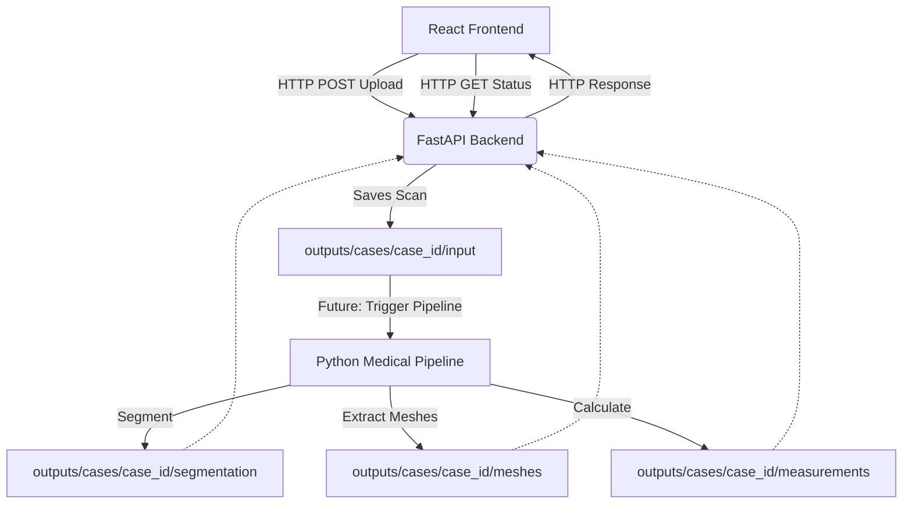

# API Architecture Reference

This document outlines the architecture for connecting the React frontend to the Python medical-imaging pipeline using FastAPI.

## Overall Flow



## 1. React Frontend (Vite)
- **Role**: User Interface and 3D Visualization.
- **Tech**: React, Three.js, React Three Fiber.
- **Interaction**: The user uploads a NIfTI scan via the browser. The React app makes an asynchronous `fetch` or `axios` POST request to the backend. It later polls or uses WebSockets to get updates and fetch the generated 3D meshes for visualization.

## 2. HTTP/REST Layer
- **Role**: Communication bridge.
- **Data Transfer**: File uploads (multipart/form-data) and JSON responses.
- **CORS**: Configured on the backend to allow requests from the frontend development server (usually `http://localhost:5173`).

## 3. FastAPI Backend
- **Role**: API Gateway, data validation, and pipeline orchestration.
- **Endpoints**:
  - `GET /api/health`: Health check.
  - `POST /api/cases/upload`: Receives the scan, generates a UUID (`case_id`), and stores it.
  - `GET /api/cases/{case_id}`: Returns case status.
- **Async capabilities**: Critical for avoiding blocked threads when calling the heavy Python imaging pipeline.

## 4. Python Medical-Imaging Pipeline
- **Role**: Core clinical logic (implemented in Days 1-4).
- **Modules**:
  - `src.segmentation`: TotalSegmentator integration.
  - `src.mesh`: Marching Cubes mesh generation.
  - `src.measurements`: Volume and distance calculations.
- **Execution**: Triggered by the FastAPI backend (eventually via background tasks or task queues like Celery/Redis in a production environment).

## 5. Case-Specific Outputs
- **Role**: Local file system storage for MVP.
- **Structure**:
  ```
  outputs/
    cases/
      {case_id}/
        input/scan.nii.gz
        segmentation/*.nii.gz
        meshes/*.obj
        measurements/report.json
  ```
- **Why**: Keeps large medical data out of memory and provides a persistent, verifiable state for each patient/case.
